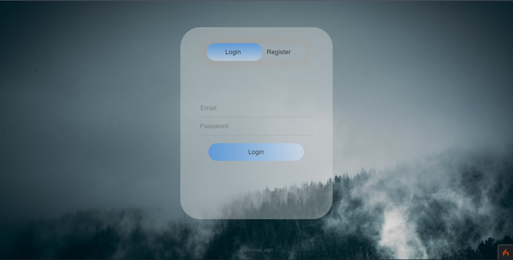
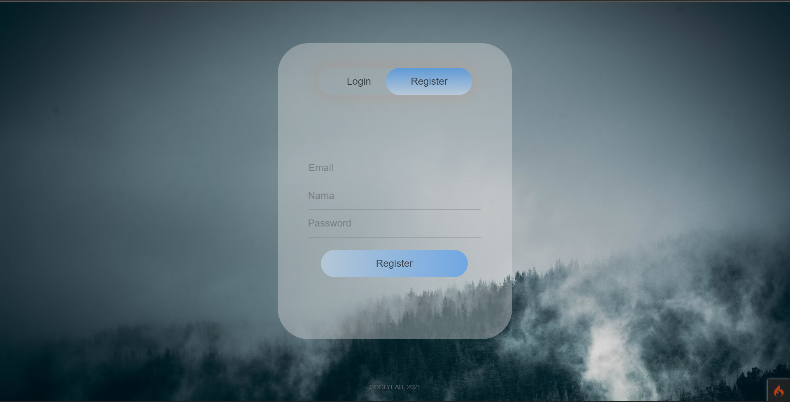
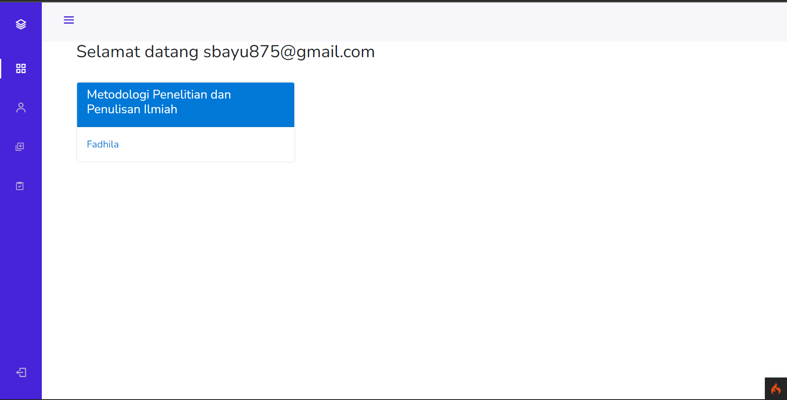
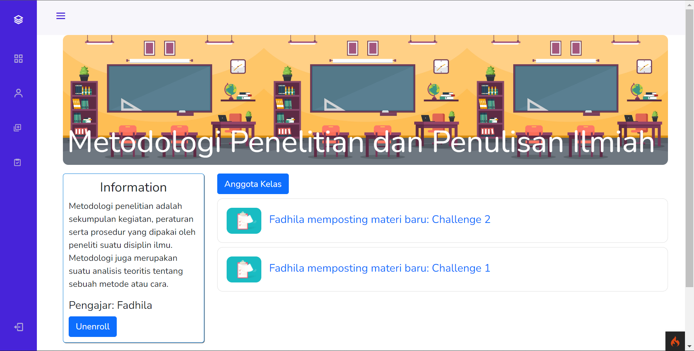
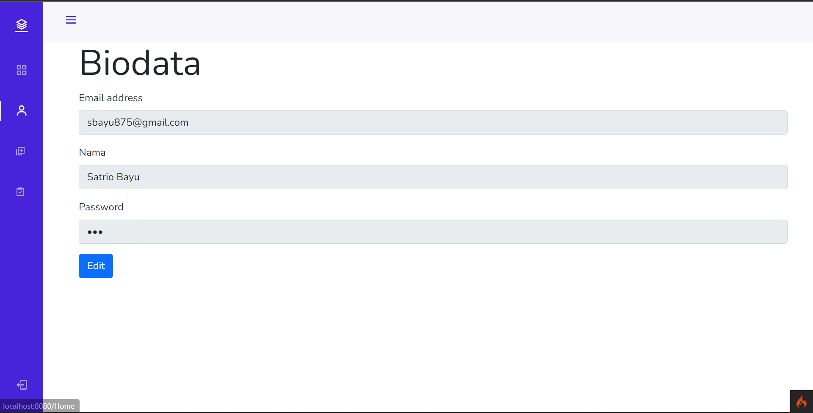
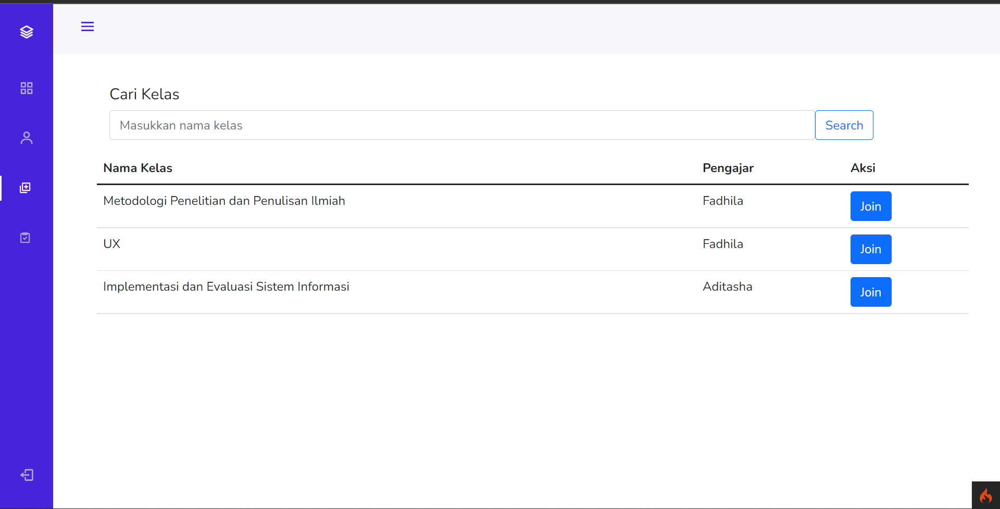
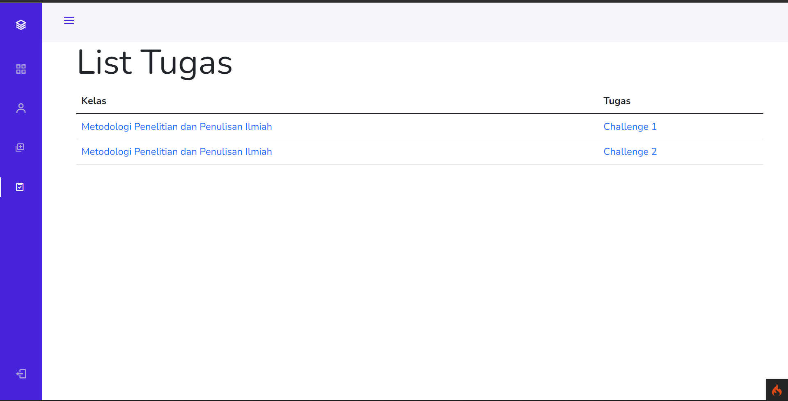
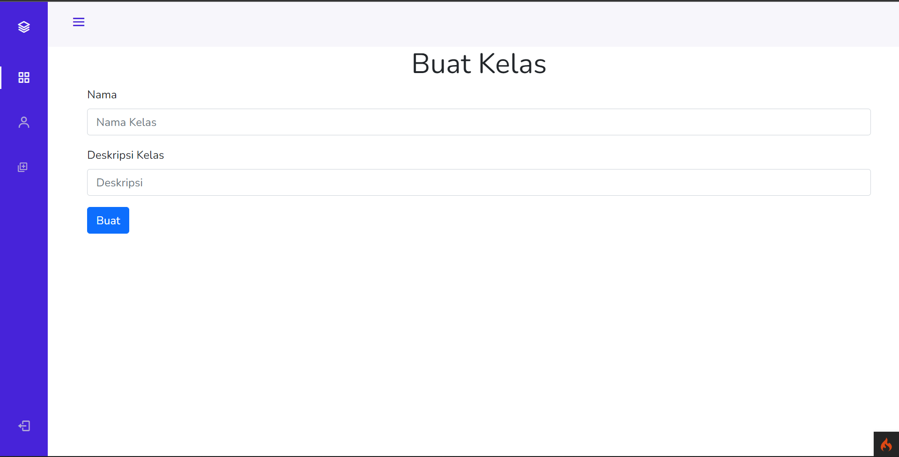

<!-- PROJECT LOGO -->
 

  

  

    Coolyeah is my final project from Web Programming course
    in Brawijaya University. Quick introduction 
    Coolyeah is web app with the idea trying to "clone" google classroom or other classrom course platform.
      
  

<!-- ABOUT THE PROJECT -->

## About The Project

    
    
    
    
    
    
    
    
  <!--   
    
   -->

 

This project was created using PHP, CodeIgniter 4 (FrameWork), PhpMyAdmin (Database) .

### Built With

- [PHP](https://www.php.net/)
- [CodeIgniter 4](https://codeigniter.com/)
- [PhpMyAdmin](https://www.phpmyadmin.net/)

<!-- ROADMAP -->

<!-- CONTACT -->

## Team Project

- [M. Satrio Bayu P](https://github.com/SatrioBayu)
- [Aditasha Fadhila](https://github.com/aditasha)
- [M. Iqbal Ardiansyah]()
- [M. Hafid Nur A](https://www.instagram.com/iqbal.ar21/)
